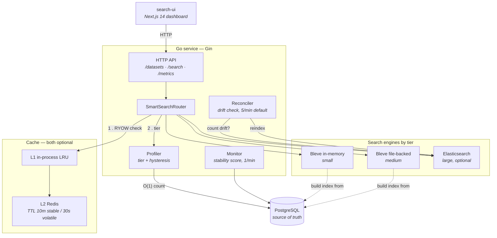
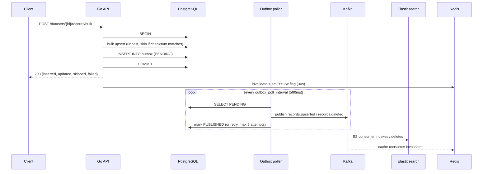

# Adaptive Search

[](https://github.com/iampopye/IMI_Hackathon/actions/workflows/ci.yml)
[](LICENSE)
[](search-system/go.mod)

**A research prototype exploring one question: can a search service pick its own
indexing strategy from live dataset characteristics, instead of being told which
one to use at deploy time?**

This repository is the artifact from that investigation — a working Go service
that measures each dataset it holds and re-selects its index backend, its cache
lifetime, and its warm set at runtime. It is a prototype, built inside a
hackathon time-box. Read the [What this is not](#what-this-is-not) section before
drawing conclusions from it.

---

## The question

Search systems are normally configured per-deployment. You decide up front that a
corpus is "small" and belongs in an in-process index, or "large" and belongs in
Elasticsearch, and that decision is baked into config. It is correct on the day
you make it and progressively wrong afterwards, because datasets grow, go
dormant, get rewritten, and change shape independently of the deploy cycle.

The investigation here asks what happens if that decision is moved out of config
and into the running system: what signals are actually available cheaply enough
to drive it, and what breaks when the system is allowed to change its own mind.

Two things turned out to matter more than expected, and both are visible in the
code:

1. **Getting the signal cheaply is the hard part, not acting on it.** A naive
   implementation reads `COUNT(*)` per dataset on the query path. That is an O(n)
   scan and it dominates everything else. The prototype replaces it with a
   trigger-maintained counter table for an O(1) read
   ([`003_dataset_counts.sql`](search-system/internal/db/migrations/003_dataset_counts.sql)).
2. **An adaptive system that reacts instantly oscillates.** A dataset sitting on a
   tier boundary will flap between backends on every write, and each flap costs an
   index rebuild. The prototype therefore requires repeated confirmation before it
   will upgrade a tier, and it decays rather than resets its volatility estimate.

---

## What "adaptive" concretely means here

Three independent mechanisms, all driven by observed behaviour rather than
configuration. This is the substance of the prototype.

### 1. Index backend selected by size, with hysteresis

[`internal/dataset/profiler.go`](search-system/internal/dataset/profiler.go)
reads the O(1) record count and maps it to a tier. Each tier has a different
engine and a fallback chain, wired in
[`internal/search/router.go`](search-system/internal/search/router.go):

| Tier | Record count | Primary engine | Fallback chain |
| --- | --- | --- | --- |
| `small` | < 100,000 | Bleve, in-memory | Bleve file-backed |
| `medium` | 100,000 – 5,000,000 | Bleve, file-backed | Bleve in-memory |
| `large` | ≥ 5,000,000 | Elasticsearch | Bleve file-backed → Bleve in-memory |

The thresholds are configurable (`in_memory_limit`, `bleve_file_limit`).

The **hysteresis** is the interesting part. Crossing a boundary upward does not
promote the dataset immediately — it must be observed above the threshold for
`tier_upgrade_confirmations` consecutive evaluations (default 5) before the
upgrade commits. Crossing downward is immediate, and resets the pending-upgrade
counter. A dataset hovering at exactly 100,000 records therefore stays put
instead of rebuilding its index on every write.

That counter is held in memory per process
(`Profiler.hCounters`), which means **the hysteresis state is per-replica and
does not survive a restart** — an acknowledged limitation, flagged in the code's
own comments as something a shared store would need to fix.

### 2. Cache lifetime selected by measured volatility

Each dataset carries a `stability_score` in `[0, 1]`, maintained by a background
monitor that ticks once a minute
([`internal/dataset/monitor.go`](search-system/internal/dataset/monitor.go),
[`meta.go`](search-system/internal/dataset/meta.go)):

- **A quiet cycle adds** `stability_tick` (default `+0.05`) — linear recovery.
- **A write decays it** by multiplying by `stability_decay` (default `×0.80`) —
  geometric punishment, so a burst of writes collapses the score fast while a
  single write barely dents it.
- **At or above `stability_threshold`** (default `0.70`) the dataset is `STABLE`.

The score feeds cache TTL selection directly: a stable dataset's search results
are cached for **10 minutes**, an unstable one's for **30 seconds**
([`internal/cache/redis.go`](search-system/internal/cache/redis.go)). Nothing
declares a dataset stable; it earns the longer TTL by not changing.

Layered on top is a **read-your-own-writes guard**: any write stamps a
`recent_writes:<dataset>` key in Redis with a 30-second TTL, and while that key
exists the search path skips both cache layers entirely rather than risk serving
a stale result to the client that just wrote.

### 3. Warm set selected by access history

Every search appends to `dataset_access_log` on a fire-and-forget goroutine. On
startup the service preloads the top `warmup_datasets` most-recently-accessed
datasets (default 50) and builds their indexes **before** it begins accepting
traffic ([`warmup.go`](search-system/internal/dataset/warmup.go)). The warm set
is thus derived from real usage rather than a hand-maintained list. The
reconciler purges access-log rows older than 30 days.

---

## Architecture



PostgreSQL is the only source of truth. Every search engine is a derived,
disposable index that can be rebuilt from it.

### The write path — transactional outbox

Writes never publish to Kafka directly, because a database commit and a broker
publish cannot be made atomic. Instead the event is written to an `outbox` table
**in the same transaction as the data**, and a poller drains it afterwards.



If the process dies between commit and publish, the event is still in the table
and the poller picks it up on restart. Events exceeding `outbox_max_attempts`
(default 5) are marked `DEAD`; the reconciler reports them and resets them to
`PENDING` for another attempt.

**The reconciler** ([`internal/reconciler/reconciler.go`](search-system/internal/reconciler/reconciler.go))
closes the loop by periodically comparing PostgreSQL record counts against
Elasticsearch document counts per dataset. On drift it triggers a zero-downtime
reindex and increments `reconciler_drift_detected_total`. This is the component
that makes the eventual consistency observable rather than merely hoped for.

### Everything external is optional

A deliberate property, and it makes the prototype far easier to run: **Redis,
Elasticsearch and Kafka are each optional**, checked at startup in
[`cmd/server/main.go`](search-system/cmd/server/main.go). With none of them
configured the service still starts and serves search — degrading to L1-only
caching, Bleve-only search, and no async pipeline. Only PostgreSQL is required.

---

## Quick start

Requires Docker and Docker Compose. The full stack is PostgreSQL, Redis,
Elasticsearch, Kibana, Kafka, Prometheus, Grafana and the Go API.

```bash
git clone https://github.com/iampopye/IMI_Hackathon.git
cd IMI_Hackathon/search-system

# The server reads config/config.yaml, which is gitignored. Create it:
cp config/config.yaml.example config/config.yaml
# then replace the two CHANGE_ME placeholders with searchuser / searchpass
# to match the credentials in docker-compose.yml

docker compose up -d          # or: make docker-up
curl localhost:8080/health    # {"status":"healthy"}
```

Migrations run automatically on startup — there is no separate migrate step.

| Service | URL | Notes |
| --- | --- | --- |
| API | http://localhost:8080 | |
| Grafana | http://localhost:3000 | `admin` / `admin`, dashboards auto-provisioned |
| Prometheus | http://localhost:9090 | |
| Kibana | http://localhost:5601 | |

To run a lighter stack, start only what you need — the service tolerates the rest
being absent: `docker compose up -d postgres redis`.

### Exercise the adaptive behaviour

```bash
# Create a dataset
DS=$(curl -s -X POST localhost:8080/datasets \
      -H 'Content-Type: application/json' \
      -d '{"name":"demo","source":"manual"}' | grep -o '"id":"[^"]*' | cut -d'"' -f4)

# Load records. IDs are derived, not supplied: SHA-256("external_id:source")
curl -s -X POST "localhost:8080/datasets/$DS/records/bulk" \
  -H 'Content-Type: application/json' \
  -d '{"records":[{"external_id":"1","source":"manual","name":"adaptive indexing","value":{"k":"v"}}]}'

# Search. The response's "engine" field reports which backend answered
# and whether a cache layer served it.
curl -s "localhost:8080/datasets/$DS/search?q=adaptive&limit=10&fuzziness=1"
```

Re-running the same search within the TTL returns an `engine` suffixed with
`+mem_cache` or `+redis_cache` — the fastest way to see the cache tiering work.
Writing to the dataset and immediately searching shows the RYOW guard bypassing
the cache instead.

### The dashboard

```bash
cd search-ui && npm install && npm run dev   # http://localhost:3000
```

Point it at the API with `NEXT_PUBLIC_API_URL` (defaults to
`http://localhost:8080`). Note this collides with Grafana's port if both run
locally.

### HTTP API

| Method | Path | Purpose |
| --- | --- | --- |
| `GET` | `/health` | Liveness; pings PostgreSQL |
| `GET` | `/ready` | Readiness |
| `GET` | `/metrics` | Prometheus exposition |
| `GET` `POST` | `/datasets` | List / create datasets |
| `POST` | `/datasets/:id/records/bulk` | Batch upsert |
| `POST` | `/datasets/:id/records/sync` | Full sync; soft-deletes anything absent from the batch |
| `DELETE` | `/datasets/:id/records/:record_id` | Soft delete |
| `GET` | `/datasets/:id/search` | `q` (required), `limit` (default 20, max 1000), `offset`, `fuzziness` (default 1) |
| `GET` | `/api/system/stats`, `/api/system/health`, `/api/activity`, `/api/performance`, `/api/datasets/:id/stats` | Dashboard feeds |

Two details worth noting. Record IDs are **derived, not assigned**:
`SHA-256("external_id:source")`, so the same natural key always produces the same
row without a central sequence. And a **content checksum makes upserts
idempotent** — if the incoming checksum matches the stored one and the row is not
soft-deleted, the SQL `WHERE` guard skips the write entirely and it is counted as
`skipped` rather than `updated`.

---

## Configuration

`config/config.yaml` is gitignored; copy `config/config.yaml.example`. Every
value below is parsed by [`internal/config/config.go`](search-system/internal/config/config.go).

| Key | Default in example | Meaning |
| --- | --- | --- |
| `app.port` | `8080` | HTTP listen port. Required. |
| `app.env` | `development` | `production` switches Gin to release mode. |
| `app.warmup_datasets` | `50` | Datasets preloaded at startup, ranked by recent access. |
| `postgres.host` / `.port` / `.user` / `.password` / `.dbname` | `localhost:5432`, `CHANGE_ME`, `searchdb` | Required. Connects with `sslmode=disable`. |
| `postgres.max_connections` / `.max_idle` | `25` / `5` | Pool sizing. |
| `elasticsearch.host` | `http://localhost:9200` | **Empty disables ES**; large tier falls back to Bleve. |
| `elasticsearch.index_prefix` | `search_` | Index naming. |
| `redis.host` | `localhost:6379` | **Empty disables L2**; L1 still runs. |
| `redis.memory_capacity` | *(absent)* | L1 LRU entry limit. |
| `kafka.broker` | `localhost:9092` | **Empty disables the whole outbox pipeline.** |
| `kafka.topics.upserted` / `.deleted` / `.changed` | `records.upserted`, `records.deleted`, `dataset.changed` | Topic names. |
| `search.in_memory_limit` | `100000` | small → medium boundary. |
| `search.bleve_file_limit` | `5000000` | medium → large boundary. |
| `search.stability_threshold` | `0.70` | Score at which a dataset counts as stable. |
| `search.stability_tick` | `0.05` | Score added per quiet monitor cycle. |
| `search.stability_decay` | `0.80` | Multiplier applied on every write. |
| `search.tier_upgrade_confirmations` | `5` | Consecutive confirmations before a tier upgrade. |
| `search.outbox_poll_interval` | `500ms` | Outbox drain frequency. |
| `search.outbox_max_attempts` | `5` | Retries before an event is marked `DEAD`. |
| `search.batch_size` / `.worker_count` | `1000` / `10` | Upsert batching and concurrency. |
| `search.bleve_data_dir` | *(absent)* | File-index directory. Falls back to `./data/bleve`. |
| `search.reconcile_interval` | *(absent)* | Drift-check cycle. Falls back to 5 minutes. |
| `search.default_result_limit` | *(absent)* | Parsed but not currently read on the search path. |
| `tls.cert_file` / `tls.key_file` | *(absent)* | Both set enables HTTPS; setting one without the other is a startup error. |

> Rows marked *(absent)* are supported by the config struct but are **not present
> in `config.yaml.example`**, so they take their code defaults unless you add
> them. This is a gap in the example file rather than in the parser.

**Environment overrides** take precedence over the YAML, which is how the
Compose and Kubernetes deployments inject credentials without rewriting config:
`POSTGRES_HOST`, `POSTGRES_USER`, `POSTGRES_DB`, `POSTGRES_PASSWORD`,
`REDIS_HOST`, `REDIS_PASSWORD`, `ELASTICSEARCH_HOST`, `ES_PASSWORD`,
`KAFKA_BROKER`, `TLS_CERT_FILE`, `TLS_KEY_FILE`.

---

## Observability

Reproducibility is the point of a research artifact, so the instrumentation is
the part of this prototype that is most worth reusing.

The service exposes Prometheus metrics on `/metrics` of the main API port
(defined in [`internal/metrics/prometheus.go`](search-system/internal/metrics/prometheus.go)):

| Metric | Type | Labels | What it tells you |
| --- | --- | --- | --- |
| `http_requests_total` | counter | `method`, `path`, `status` | Request volume and error rate |
| `http_request_duration_seconds` | histogram | `method`, `path` | Handler latency |
| `search_requests_total` | counter | `tier`, `cache_layer`, `status` | **Which tier and which cache layer served each query** |
| `search_duration_seconds` | histogram | `tier` | Latency broken out per tier |
| `cache_hits_total` / `cache_misses_total` | counter | `layer` (L1/L2) | Cache effectiveness per layer |
| `upsert_records_total` | counter | `status` | inserted / updated / **skipped** / failed |
| `upsert_duration_seconds` | histogram | — | Bulk write cost |
| `outbox_events_total` | counter | `status` | published / dead / retried |
| `outbox_pending_total` | gauge | — | Outbox backlog depth |
| `es_index_operations_total` | counter | `operation`, `status` | ES pipeline throughput and errors |
| `reconciler_drift_detected_total` | counter | — | **How often PG and ES actually diverged** |
| `reconciler_reindex_total` | counter | — | Zero-downtime reindexes triggered |
| `dataset_tier_transitions_total` | counter | `from_tier`, `to_tier` | **How often the adaptive tiering fired, and in which direction** |

The last one is the key experimental measurement: it is the direct record of the
adaptation actually happening, and pairing it with `search_duration_seconds` is
how you check whether a transition helped or hurt.

Four Grafana dashboards are auto-provisioned from
[`grafana/dashboards/`](search-system/grafana/dashboards):

1. **API Overview** — request rate, p50/p95/p99 latency, 4xx/5xx rates, 5xx ratio
2. **Search Performance** — request rate and latency by tier, L1/L2 hits vs
   misses, cache hit rate, errors by tier
3. **Write Pipeline** — upsert rate and duration, outbox backlog and throughput,
   ES index operations and error rate
4. **System Health** — PG↔ES drift events, reindexes, dead outbox events,
   reconciler activity, **tier transitions**, aggregate failure signals

> ⚠️ `prometheus.yml` scrapes the hardcoded target `172.17.0.1:8080` — the Docker
> bridge gateway, i.e. the API running on the *host*. If you run the API inside
> Compose (`docker compose up api`), change this to `api:8080` or Prometheus will
> scrape nothing.

---

## Tests

70 tests and 11 benchmarks across 14 test files.

```bash
cd search-system

go test ./... -race                 # unit + chaos; DB-backed tests self-skip
make test                           # verbose, no cache
make test-race                      # race detector
make bench                          # benchmarks only
```

**Chaos tests** ([`internal/integration/chaos_test.go`](search-system/internal/integration/chaos_test.go))
need no database. They target the concurrency properties directly: LRU eviction
under 10× capacity pressure, and simultaneous insert/delete against the B-Tree
index to prove the absence of data races. Run them under `-race` or they prove
much less:

```bash
make test-chaos                     # or: go test ./... -run Chaos -race
```

**Integration tests** ([`internal/integration/integration_test.go`](search-system/internal/integration/integration_test.go),
[`internal/db/migrate_test.go`](search-system/internal/db/migrate_test.go)) need a
real PostgreSQL and **skip themselves silently when `TEST_POSTGRES_DSN` is
unset** — so a green `go test ./...` on a machine with no database does *not*
mean they passed. Set the DSN to actually run them:

```bash
docker compose up -d postgres
createdb searchdb_test   # or: docker compose exec postgres createdb -U searchuser searchdb_test

TEST_POSTGRES_DSN="host=localhost port=5432 user=searchuser password=searchpass dbname=searchdb_test sslmode=disable" \
  go test ./internal/db/... ./internal/integration/... -race -v
```

They run migrations against the live database and cover the full write path,
outbox behaviour, soft-delete and sync-token purging, and tier evaluation. CI
runs them in a dedicated job with a PostgreSQL 16 service container, so the
skip-by-default behaviour does not silently hide failures.

### On the benchmarks

The 11 benchmarks are **micro-benchmarks** — L1 cache get/set with and without
eviction pressure, Bleve search over 100 and 1,000 documents, fuzzy vs exact
query cost, and the SHA-256 ID/checksum and batching helpers.

**No benchmark results are committed to this repository, and none are quoted in
this README.** They are reproducible by running `make bench`, but any numbers
they produce are specific to the machine that ran them. Note also what they do
*not* cover: there is **no committed benchmark of the adaptive tiering itself** —
no measurement of what a tier transition costs, or of whether the chosen tier
beats the alternatives at a given corpus size. That comparison is the obvious
next experiment and it has not been run.

---

## Project layout

```
search-system/                 Go service
├── cmd/server/                Entrypoint; wires every component
├── internal/
│   ├── api/                   Gin router, handlers, CORS + Prometheus middleware
│   ├── cache/                 L1 in-process LRU, L2 Redis, TTL + RYOW policy
│   ├── config/                YAML load, env overrides, validation
│   ├── dataset/               ADAPTATION LIVES HERE — profiler, monitor,
│   │                          stability scoring, warmup, tier state
│   ├── db/                    Pool, embedded SQL migrations
│   ├── integration/           Chaos + DB-backed end-to-end tests
│   ├── metrics/               Prometheus collectors
│   ├── outbox/                Transactional outbox writer + poller
│   ├── pipeline/              Kafka producer, ES consumer, cache consumer
│   ├── reconciler/            PG ↔ ES drift detection and repair
│   ├── search/                Tier router, Bleve memory/file, ES, B-Tree index
│   └── upsert/                Batch upsert, checksums, soft delete, sync tokens
├── grafana/                   4 dashboards + provisioning
├── k8s/                       Kubernetes manifests (namespace → api)
├── docker-compose.yml         Full local stack
└── Makefile                   Build, test, docker, kind targets

search-ui/                     Next.js 14 dashboard (App Router, Tailwind, Recharts)
docs/                          GitHub Pages landing page
setup-ec2.sh                   Single-VM bootstrap script
```

---

## What this is not

A research prototype earns credibility by being precise about its limits. These
are real, and they are stated here so nobody has to discover them the hard way.

**Not production-hardened.**

- **There is no authentication or authorisation on any endpoint.** Anyone who can
  reach the port can read, write and delete every dataset.
- **CORS is `Access-Control-Allow-Origin: *`**, hardcoded in the router.
- The Compose stack ships development credentials (`searchuser`/`searchpass`,
  Grafana `admin`/`admin`) and connects to PostgreSQL with `sslmode=disable`.
- Compose publishes Elasticsearch, Kibana, Kafka, Prometheus and Grafana to the
  host, which is convenient locally and wrong anywhere else.

**Not proven at scale.** The tier thresholds — 100K and 5M records — are
*design parameters, not empirical findings*. They were chosen as plausible
boundaries, not derived from measurement. The system has not been run against a
5M+ record corpus, so the `large` tier and its Elasticsearch path are the least
exercised part of the codebase. Treat any claim about behaviour at those volumes
as untested.

**Known incomplete implementations.**

- `Monitor.performBTreeBuild` is **an explicit no-op stub**. The surrounding
  machinery is real and working — PostgreSQL advisory locks so only one replica
  sorts a dataset, plus the full `is_sorting`/`is_sorted` state transition — but
  the build it guards does nothing. The state machine is exercised; the sort is
  not implemented.
- `internal/search/btree_index.go` implements a real concurrent B-Tree index and
  is covered by unit and chaos tests, but it is **not wired into the query
  path** — `SmartSearchRouter` only routes to Bleve and Elasticsearch.
- Tier hysteresis counters are per-process and in-memory, so they neither survive
  a restart nor coordinate across replicas.
- `search.default_result_limit` is parsed from config but never read.

**What you should and should not conclude.** This repo demonstrates that
runtime-adaptive index selection is *implementable* with cheap signals — a
trigger-maintained counter, an access log, and a decaying volatility score — and
it shows the specific failure mode (oscillation) that any such system has to
solve. It does **not** demonstrate that adaptation outperforms static
configuration, because that comparison was never measured. Anyone tempted to cite
this as evidence that adaptive tiering is faster should run the missing benchmark
first.

**Origin.** This was built as a hackathon project, single-author, inside a
time-box. That constraint explains the shape of it: the mechanisms that answer
the research question are built out properly and instrumented, while the parts
that only matter for production — auth, scale testing, the B-Tree build — are
stubs or absent. The phase numbering left in the source comments (`Phase 4`,
`Phase 8`…) is the original build order.

---

## Contributing

Contributions are welcome — especially the missing tiering benchmark, or
evidence that any conclusion above is wrong.

See **[CONTRIBUTING.md](CONTRIBUTING.md)**. In short: contributions are accepted
under the MIT licence, and every commit needs a
[DCO](https://developercertificate.org/) sign-off — `git commit -s`. There is no
CLA.

Security issues should not go in a public issue; see
**[SECURITY.md](SECURITY.md)**.

---

## Maintainer

**Karan Garg** — engineer and community professional working on search and
distributed systems.

- GitHub: [@iampopye](https://github.com/iampopye)
- X: [@mrtechgarg](https://x.com/mrtechgarg)
- LinkedIn: [karan-garg-tech](https://www.linkedin.com/in/karan-garg-tech/)

---

## Licence

[MIT](LICENSE) © 2026 Karan Garg
